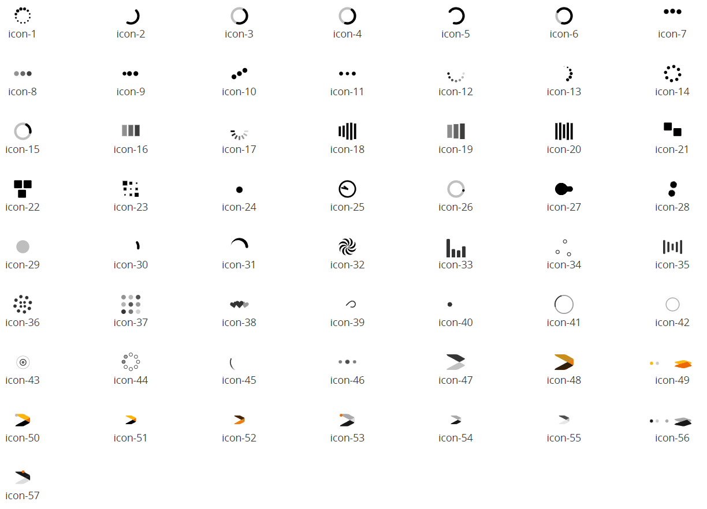

# Custom Page Loading Indicator <!-- omit in toc -->

A subtle animation at the bottom of the page just above the footer element indicates to the user that the page is busy fetching data from a database or web service. This repo allows you to customise the loader in a variety of ways. 

https://github.com/user-attachments/assets/fdb090ee-ce30-43f9-a181-9b5b21a3abaa

# Version
Initial 1.0

# Setup

## Application Setup
1. Check the *Enable Style Sheet* checkbox in the application properties

## Global Script
1. Create a Global Script called "PageLoader"
2. Add the input parameters below to the Global Script
   1. Type
3. Drag a *JavaScript* action into the script
4. Add the Javascript below into the JavaScript code property
```javascript
/* Stadium Script v1.0 https://github.com/stadium-software/page-loader */
let classname = ~.Parameters.Input.Type;
if (!classname) { 
    console.error("The 'Type' parameter is required");
    return false;
}
if (!classname.startsWith("spinner-type-")) classname = "page-loader-" + classname;
let container = document.querySelector("#busy-indicator");
let indicator = container.querySelector(".busy-indicator");
let inner = indicator.querySelector(".busy-indicator-inner");
if (!inner) {
    inner = document.createElement("div");
} else {
    inner.setAttribute("class", "");
}
container.classList.remove("stadium-spinner");
if (classname.startsWith("spinner-type-")) container.classList.add("stadium-spinner");
inner.classList.add("busy-indicator-inner", classname);
indicator.appendChild(inner);
container.appendChild(indicator);
```

## StartPage or Template Page.Load
1. Drag the "PageLoader" script into the **first position (!!)** in the Page.Load event handler of the StartPage or the StartPage Template. This will apply the specified loader across the entire application. 
2. Drag the "PageLoader" script into the **first position (!!)** in the Page.Load event handler of any other page or template to change the loader. 
3. Provide a value for the script *Type* input parameter
   1. classic-bar: Customise the standard Stadium bar loader
   2. icon-X: Find an animated icon in the image below and place it somewhere on the screen by adjusting the '--page-loader-icon-top-position', '--page-loader-icon-right-position', '--page-loader-icon-bottom-position' and '--page-loader-icon-left-position' variables in the [*page-loader-variables.css*](page-loader-variables.css) file
   3. icon: Add your own animated icon and place it somewhere on the screen
   4. custom: Choose and animate your own icon by writing a CSS animation
   5. spinner-type-X: [Use any Spinner](#using-a-spinner) from the [Spinners](https://github.com/stadium-software/spinners) repo (see [Using a Spinner](#using-a-spinner))
4. Use the variables in the [*page-loader-variables.css*](page-loader-variables.css) file to customise the loader ([see below](#page-loader-customisations))



## CSS
The CSS below is required for the correct functioning of the module. Some elements can be [customised](#customising-css) using a variables CSS file. 

1. Create a folder called "CSS" inside of your Embedded Files in your application
2. Drag the two CSS files from this repo [*page-loader-variables.css*](page-loader-variables.css) and [*page-loader.css*](page-loader.css) into that folder
3. Paste the link tags below into the *head* property of your application
```html
<link rel="stylesheet" href="{EmbeddedFiles}/CSS/page-loader.css">
<link rel="stylesheet" href="{EmbeddedFiles}/CSS/page-loader-variables.css">
``` 

### CSS Upgrading
To upgrade the CSS in this module, follow the [steps outlined in this repo](https://github.com/stadium-software/samples-upgrading)

## Page Loader Customisations
1. Open the CSS file called [*page-loader-variables.css*](page-loader-variables.css) from this repo
2. Adjust the variables in the *:root* element as you see fit
3. Overwrite the file in the CSS folder of your application with the customised file

## Base64 Encoded Images
To display icons, this module uses Base64 encoded image strings. Using this method has the advantage that images do not have to be included in the application as separate files as they are directly inserted into the CSS stylesheet

**Base64 Encoding**
1. Some icon sites (e.g. https://icones.js.org/collection/all) provide this as a standard download option (select "Data Url" from the option buttons in this example)
2. Any image can also be converted to a Base64 encoded string in a number of sites (e.g. https://base64.guru/ - choose "Data URI" or "CSS Background" from the "Output options" dropdown)

## Using a Spinner
Spinners cover the entire page while any party of it is loading. This makes it very obvious to the users that the page is loading and also prevents them from interacting with the UI. To use a Spinner:

1. Include both [Spinners](https://github.com/stadium-software/spinners) CSS files in the CSS folder in the EmbeddedFiles in your application
2. Paste the link tags below into the *head* property of your application
```html
<link rel="stylesheet" href="{EmbeddedFiles}/CSS/spinners.css">
<link rel="stylesheet" href="{EmbeddedFiles}/CSS/spinners-variables.css">
```
3. Follow the instructions in the [Page.Load](#pageload) section

## Working with Stadium Repos
Stadium Repos are not static. They change as additional features are added and bugs are fixed. Using the right method to work with Stadium Repos allows for upgrading them in a controlled manner. How to use and update application repos is described here 

[Working with Stadium Repos](https://github.com/stadium-software/samples-upgrading)
